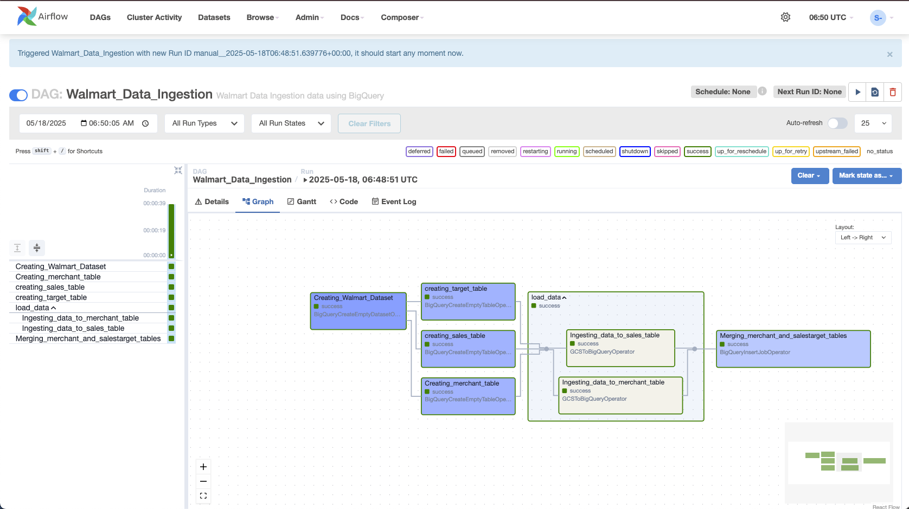
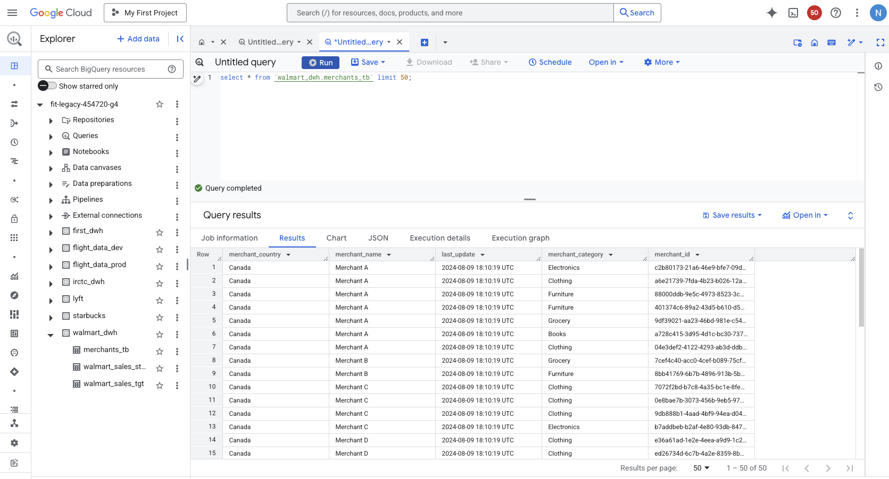
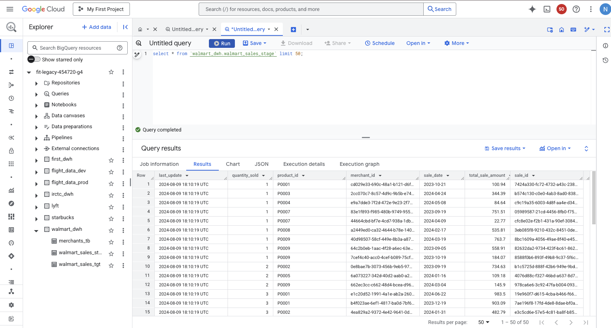
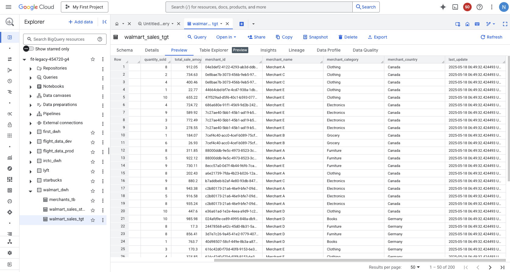
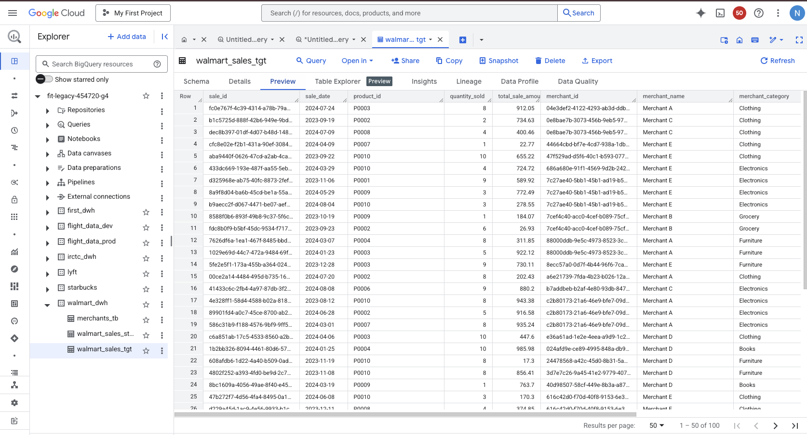

# 📦 Walmart Data Ingestion Pipeline

This Airflow DAG orchestrates the ingestion and transformation of Walmart sales and merchant data into BigQuery. It creates datasets and tables, ingests JSON data from GCS, and performs a `MERGE` to produce a unified target table.

---

## 🛠️ DAG Execution in Airflow

---

## 📋 Merchant Table Preview

This table stores merchant metadata ingested from `merchants.json`.

---

## 📈 Sales Stage Table

Raw sales data loaded from GCS into a staging table.

---

## 🔁 Target Table After Merge (Upsert Logic)

Result after running the DAG — a `MERGE` operation enriches sales data with merchant metadata.

### 🧾 First Upsert

### 📊 Full Target Table View

---

## ⚙️ Tasks Breakdown

| Task ID                            | Description                                                      |
|-----------------------------------|------------------------------------------------------------------|
| `Creating_Walmart_Dataset`        | Creates a BigQuery dataset `walmart_dwh`                         |
| `Creating_merchant_table`         | Creates the `merchants_tb` table                                 |
| `creating_sales_table`            | Creates the `walmart_sales_stage` staging table                  |
| `creating_target_table`           | Creates the `walmart_sales_tgt` target table                     |
| `Ingesting_data_to_merchant_table`| Loads merchant data from GCS                                     |
| `Ingesting_data_to_sales_table`   | Loads sales data from GCS                                        |
| `Merging_merchant_and_salestarget_tables` | Merges sales and merchant data into target table         |

---

## 📊 Data Sources

- **GCS Bucket**: `bigquery-projectss`
- **Source Files**:
  - `walmart_ingestion/merchants/merchants.json`
  - `walmart_ingestion/sales/walmart_sales.json`

---

## ✅ Highlights

- Built using `BigQueryInsertJobOperator` (recommended over legacy operators)
- Uses `MERGE` to upsert and enrich sales data
- Designed to be environment-agnostic and Cloud Composer compatible

---

## 🧑‍💻 Maintainer

**Niranjana Subramanian**  
_Data Engineer_